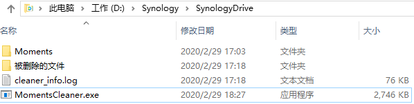

# MomentsCleaner 
群晖Moments重复文件清理工具 
扫描当前目录及所有子目录下的重复文件(根据文件md5值)，将同文件目录下的重复文件删除 

下载链接：

## 工具来由
 群晖moments经常在同个文件夹下出现好多重复文件,比如xxx_1.jpg,xxx_2.jpg,占用空间 
 群晖自带的存储空间分析器能够将重复文件列出并删除，但都需要手动判别删除，重复文件过多就难受了 
 需要一个安全的自动化的工具，so MomentsCleaner come  
  
## 使用
1，需要在windows系统中使用SynologyDrive设置同步Moments,将所有照片同步到本地 
2，在本地Moments文件目录下或子文件目录，将下载好的MomentsCleaner.exe放入，执行 

执行完成后，会生成"被删除的文件"目录，所有被删除的文件全在这里，检查后再删除 
3，清理后(将momentscleaner.exe,cleaner_info.log,被删除的文件全删)，开启Drive的双向同步（或单向上传）将更新同步到群晖上

## 说明
  为什么只删除同文件目录下的重复文件？ 
  这是因为群晖moments在同个文件夹下容易出现重复文件，只处理同文件目录下的重复文件，安全并在大部分场景下效果达到 
  
  两个文件重复，删除哪一个？ 
  根据名字长度，名称较短的保留，其它删除 
 
